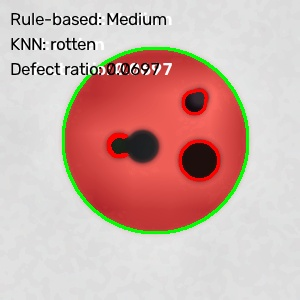

# 🍎 Fruit Quality Grading Using Computer Vision

A computer vision and machine learning system that analyzes fruit images, detects visible surface defects, classifies fruit condition (fresh/rotten), and assigns a quality grade — built entirely with classical CV techniques (OpenCV) and a lightweight KNN classifier. No deep learning required.

Built as a course project (VITyarthi "Build Your Own Project" evaluation, VIT Bhopal).

---

## 📌 Overview

Manual fruit inspection is slow and subjective. This project automates it: given a photo of a fruit, the system isolates the fruit from its background, detects blemishes, extracts a set of handcrafted visual features, and produces two complementary outputs:

- **Condition classification** — Fresh / Rotten (via a trained KNN classifier)
- **Quality grade** — Good / Medium / Poor (via a rule-based defect-ratio threshold)

Each processed image also gets an annotated output image (fruit outline, blemish contours, and grade text overlaid) saved to `outputs/`.

## ✨ Features

- End-to-end CLI to grade a single image (`main.py`)
- Batch grading tool that walks a directory and produces a CSV report (`tools/batch_grade.py`)
- Synthetic dataset generator so the pipeline can be tested with zero external data (`tools/generate_sample_dataset.py`)
- Fully classical CV pipeline — Gaussian/bilateral denoising, CLAHE contrast enhancement, Otsu segmentation, HSV blemish detection, K-Means color clustering, PCA-reduced color histograms, Canny edge density, Harris corner density
- Dual grading: an interpretable rule-based grade alongside a trained KNN prediction
- Unit tests covering preprocessing, segmentation, and classification logic
- Drop-in compatible with the real Mendeley "Fruits Dataset for Classification" folder layout — no code changes needed to swap in real data

## 🧰 Technologies / Tools Used

- Python 3.10+
- OpenCV (`opencv-python`) — image processing
- scikit-learn — PCA, KNN, StandardScaler, train/test split
- NumPy
- joblib — model/PCA persistence
- pytest — unit testing
- Git / GitHub — version control

## 🔄 System Workflow

```text
                Input Fruit Image
                        │
                        ▼
              1. Preprocessing
    (resize → Gaussian + bilateral denoise → CLAHE)
                        │
                        ▼
              2. Segmentation
      (Otsu threshold on HSV saturation → fruit mask)
                        │
                        ▼
              3. Blemish Detection
     (HSV value-channel threshold inside fruit mask)
                        │
                        ▼
              4. Feature Extraction
  (PCA color histogram, edge density, corner density,
        K-Means dominant colors, defect ratio)
                        │
                        ▼
              5. Grading
     ┌──────────────────┴──────────────────┐
     ▼                                      ▼
Rule-based (defect ratio)          KNN classifier
→ Good / Medium / Poor             → Fresh / Rotten
     └──────────────────┬──────────────────┘
                        ▼
              6. Reporting
     (annotated image + console/CSV output)
```

See `docs/diagrams.md` for the system architecture, use case, class, and sequence diagrams.

## 📁 Project Structure

```text
fruit-quality-grader/
  main.py                        CLI entrypoint: grade a single image
  config.py                      All tunable parameters in one place
  src/
    preprocessing.py             Module 1: load, resize, denoise, CLAHE
    segmentation.py              Module 2: Otsu mask, K-Means, blemish detection
    features.py                  Module 3: histograms, PCA, edge/corner density
    classifier.py                Module 4: rule-based grading + KNN
    report.py                    Module 5: annotated image generation
  tools/
    generate_sample_dataset.py   Synthetic dataset generator
    build_dataset.py             Builds feature matrix + fits PCA
    batch_grade.py                Grades a whole directory, writes CSV report
  tests/
    test_preprocessing.py
    test_segmentation.py
    test_classifier.py
  docs/
    diagrams.md                  Architecture, UML, and sequence diagrams
  data/sample/                   Generated synthetic images (gitignored)
  models/                        Trained PCA + KNN bundle (gitignored)
  outputs/                       Annotated graded images + batch report (gitignored)
```

## ⚙️ Non-Functional Requirements

- **Performance** — Images are capped at 512px on the longest side before processing, keeping per-image runtime predictable regardless of input resolution.
- **Reliability** — `safe_imread` raises a specific `ImageLoadError` instead of failing silently, so batch runs skip unreadable files instead of crashing.
- **Maintainability** — All tunable parameters (thresholds, kernel sizes, PCA components) live in one place (`config.py`), so pipeline stages don't need code changes to retune.
- **Testability** — Core logic (grading thresholds, KNN training, preprocessing, segmentation) is covered by automated tests independent of any specific dataset.
- **Portability** — The data folder layout matches the real Mendeley fruit dataset, so switching from synthetic to real data requires no code changes — only a different `--data` path.

## 🚀 Setup

```bash
python -m venv venv
source venv/Scripts/activate   # Windows Git Bash
# source venv/bin/activate     # macOS/Linux
pip install -r requirements.txt
```

## ▶️ Usage

**1. Generate synthetic sample data** (no internet or real dataset needed):

```bash
python tools/generate_sample_dataset.py --out data/sample --per-class 40
```

**2. Build the feature dataset and fit PCA:**

```bash
python tools/build_dataset.py --data data/sample
```

**3. Train the KNN classifier:**

```bash
python -c "
import joblib
from src.classifier import train_knn, save_model_bundle

data = joblib.load('data/features.joblib')
model, scaler, acc, report = train_knn(data['X'], data['y'])
print('Test accuracy:', acc)

pca = joblib.load('models/pca.joblib')
save_model_bundle(model, scaler, pca)
"
```

**4. Grade a single image:**

```bash
python main.py --image data/sample/apple/rotten/img_000.jpg
```

Prints both grades to the console and saves an annotated image to `outputs/`.

**5. Grade an entire directory:**

```bash
python tools/batch_grade.py --dir data/sample
```

Produces `outputs/batch_report.csv` with the image path, fruit type, actual condition, rule-based grade, KNN prediction, defect ratio, and output image path per row.

## 🧪 Testing

```bash
python -m pytest tests/ -v
```

Covers rule-based grading thresholds, KNN training, image preprocessing, fruit segmentation, and blemish detection.

## 📊 A Note on Accuracy

The KNN classifier scores 100% on the synthetic dataset. This is **not** representative of real-world performance — the synthetic fresh/rotten classes are deliberately easy to separate (a plain circle vs. a circle with dark blobs). Real fruit photos will have subtler, noisier blemishes, inconsistent lighting, and background clutter, so accuracy on real data will be lower. The 240-image synthetic batch run produced 240/240 correct predictions, which validates the pipeline mechanics, not real-world generalization.

## 🍏 Using a Real Dataset

The folder layout (`data/<root>/<fruit>/<condition>/*.jpg`) matches the Mendeley "Fruits Dataset for Classification" layout, so real data can be substituted by pointing `tools/build_dataset.py --data <path>` at a real dataset directory instead of `data/sample` — no code changes needed.

## 📷 Screenshots


## 🔮 Future Enhancements

- Replace KNN with a small CNN once a real labelled dataset is available
- Web/GUI front-end for uploading a single image and viewing the grade instantly
- Per-fruit-type calibration of blemish HSV thresholds instead of one global setting

## 📚 References

- Mendeley "Fruits Dataset for Classification"
- OpenCV documentation
- scikit-learn documentation
