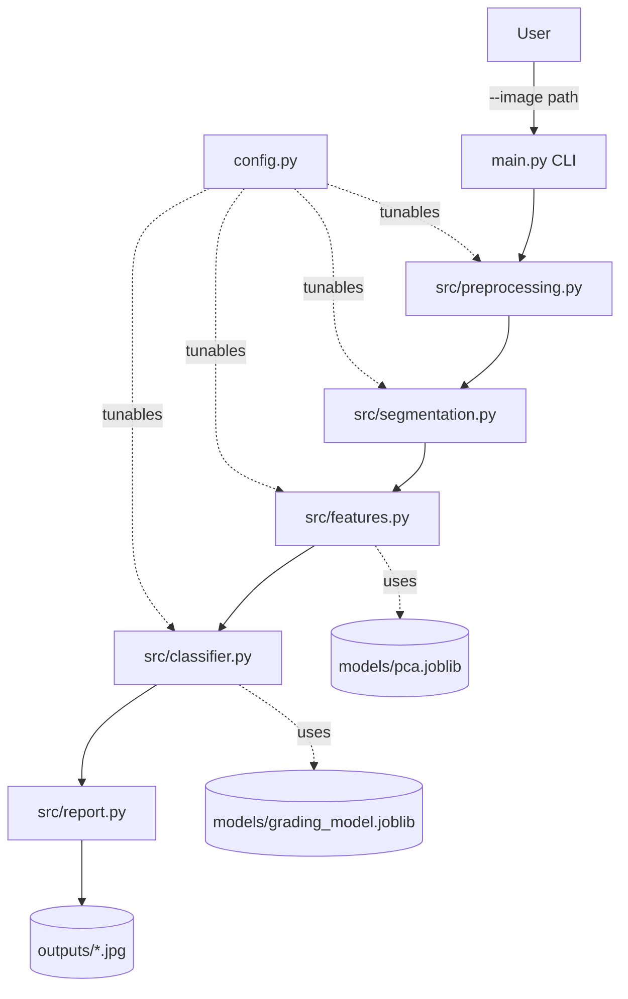
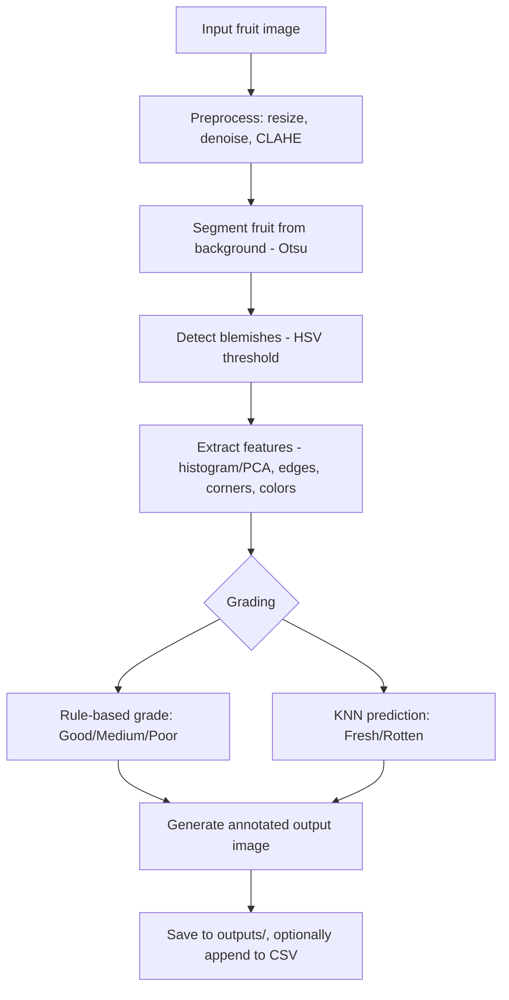
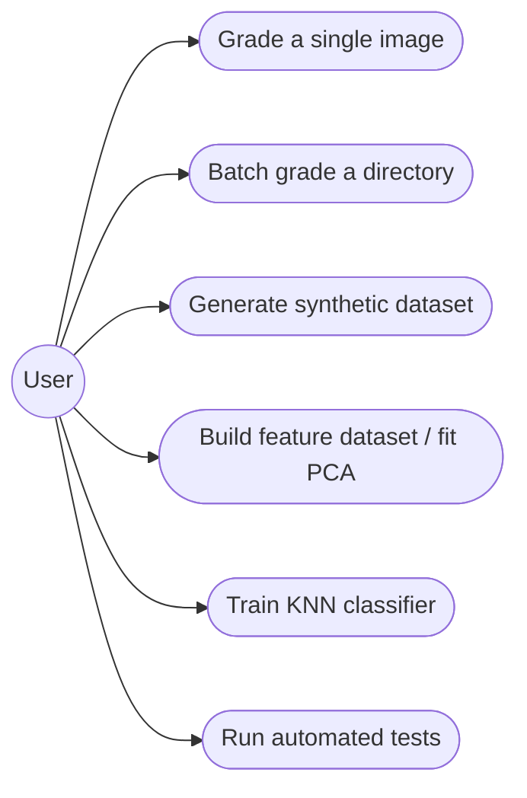
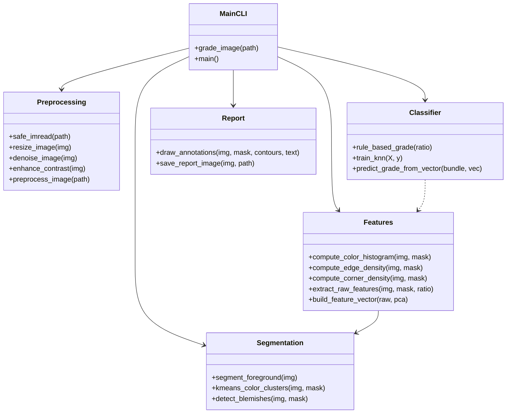
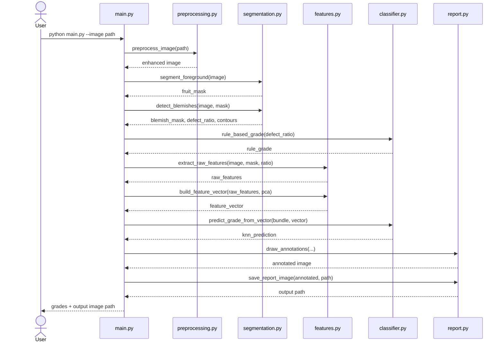

# Diagrams

## System Architecture

```mermaid
graph TD
    User[User] -->|--image path| CLI[main.py CLI]
    CLI --> Pre[src/preprocessing.py]
    Pre --> Seg[src/segmentation.py]
    Seg --> Feat[src/features.py]
    Feat --> Clf[src/classifier.py]
    Clf --> Rep[src/report.py]
    Rep --> Out[(outputs/*.jpg)]
    Clf -.uses.-> Model[(models/grading_model.joblib)]
    Feat -.uses.-> PCA[(models/pca.joblib)]
    Config[config.py] -.tunables.-> Pre
    Config -.tunables.-> Seg
    Config -.tunables.-> Feat
    Config -.tunables.-> Clf
```

## Process / Workflow Diagram

```mermaid
flowchart TD
    A[Input fruit image] --> B[Preprocess: resize, denoise, CLAHE]
    B --> C[Segment fruit from background - Otsu]
    C --> D[Detect blemishes - HSV threshold]
    D --> E[Extract features - histogram/PCA, edges, corners, colors]
    E --> F{Grading}
    F --> G[Rule-based grade: Good/Medium/Poor]
    F --> H[KNN prediction: Fresh/Rotten]
    G --> I[Generate annotated output image]
    H --> I
    I --> J[Save to outputs/, optionally append to CSV]
```

## Use Case Diagram

```mermaid
flowchart LR
    User((User))
    UC1([Grade a single image])
    UC2([Batch grade a directory])
    UC3([Generate synthetic dataset])
    UC4([Build feature dataset / fit PCA])
    UC5([Train KNN classifier])
    UC6([Run automated tests])

    User --> UC1
    User --> UC2
    User --> UC3
    User --> UC4
    User --> UC5
    User --> UC6
```

## Class / Component Diagram

```mermaid
classDiagram
    class Preprocessing {
        +safe_imread(path)
        +resize_image(img)
        +denoise_image(img)
        +enhance_contrast(img)
        +preprocess_image(path)
    }
    class Segmentation {
        +segment_foreground(img)
        +kmeans_color_clusters(img, mask)
        +detect_blemishes(img, mask)
    }
    class Features {
        +compute_color_histogram(img, mask)
        +compute_edge_density(img, mask)
        +compute_corner_density(img, mask)
        +extract_raw_features(img, mask, ratio)
        +build_feature_vector(raw, pca)
    }
    class Classifier {
        +rule_based_grade(ratio)
        +train_knn(X, y)
        +predict_grade_from_vector(bundle, vec)
    }
    class Report {
        +draw_annotations(img, mask, contours, text)
        +save_report_image(img, path)
    }
    class MainCLI {
        +grade_image(path)
        +main()
    }

    MainCLI --> Preprocessing
    MainCLI --> Segmentation
    MainCLI --> Features
    MainCLI --> Classifier
    MainCLI --> Report
    Features --> Segmentation
    Classifier ..> Features
```

## Sequence Diagram

```mermaid
sequenceDiagram
    actor User
    participant CLI as main.py
    participant Pre as preprocessing.py
    participant Seg as segmentation.py
    participant Feat as features.py
    participant Clf as classifier.py
    participant Rep as report.py

    User->>CLI: python main.py --image path
    CLI->>Pre: preprocess_image(path)
    Pre-->>CLI: enhanced image
    CLI->>Seg: segment_foreground(image)
    Seg-->>CLI: fruit_mask
    CLI->>Seg: detect_blemishes(image, mask)
    Seg-->>CLI: blemish_mask, defect_ratio, contours
    CLI->>Clf: rule_based_grade(defect_ratio)
    Clf-->>CLI: rule_grade
    CLI->>Feat: extract_raw_features(image, mask, ratio)
    Feat-->>CLI: raw_features
    CLI->>Feat: build_feature_vector(raw_features, pca)
    Feat-->>CLI: feature_vector
    CLI->>Clf: predict_grade_from_vector(bundle, vector)
    Clf-->>CLI: knn_prediction
    CLI->>Rep: draw_annotations(...)
    Rep-->>CLI: annotated image
    CLI->>Rep: save_report_image(annotated, path)
    Rep-->>CLI: output path
    CLI-->>User: grades + output image path
```
